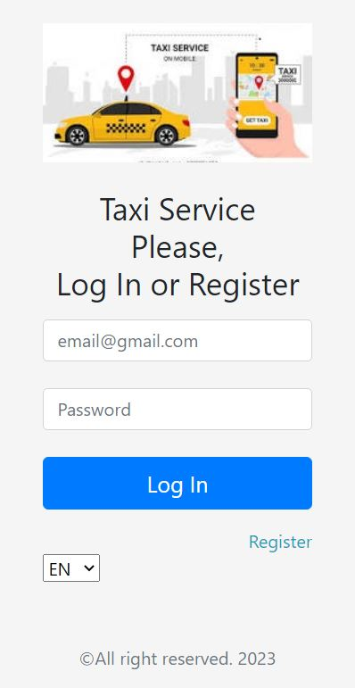

# Taxi Service

PROJECT DESCRIPTION

The task of the final project is to develop a web application that supports the functionality according to the task variant.

Variants 
Taxi Service 
There are roles: "Client", "Administrator".
The customer registers in the system and has the opportunity to place an order for a taxi, specifying the address of departure, destination, number of passengers and car category.
The taxi has a fleet of drivers. The car has characteristics for capacity, category and can be: “available to order", "on route" or be inactive (located in the fleet without a driver).
The system calculates the cost of the trip depending on the distance and assigns the appropriate car among the available ones. If there are no suitable cars - the customer may be asked to cancel the order or use an alternative solution:
- car with the required number of seats, but a different category;
- several cars of the selected category to provide the required capacity.
The system supports the loyalty program - a discount is calculated depending on the amount spent.
After the customer confirms the order, the system reports the waiting time.
The system administrator can view order statistics, sort:
- by the date of order;
- at the cost of the order
and filter orders:
- by clients;
- by certain dates.

ОПИС ПРОЕКТУ 
Завдання фінального проекту - розробити веб-застосунок, що підтримує функціональність відповідно до варіанту завдання.
Вимоги до реалізації: 
1. На основі сутностей предметної області створити класи, які їм відповідають. 
2. Класи і методи повинні мати назви, що відображають їх функціональність, і повинні бути рознесені по пакетам. 
3. Оформлення коду має відповідати Java Code Convention. 
4. Інформацію щодо предметної області зберігати у реляційній базі даних (в якості СУБД рекомендується використовувати MySQL або PostgreSQL). 
5. Для доступу до даних використовувати JDBC API із застосуванням готового або ж розробленого самостійно пулу з'єднань.
НЕ допускається використання ORM фреймворків
6. Застосунок має підтримувати роботу з кирилицею (бути багатомовним), в тому числі при зберіганні інформації в базі даних:  
a. повинна бути можливість перемикання мови інтерфейсу; 
b. повинна бути підтримка введення, виведення і зберігання інформації (в базі даних), записаної на різних мовах;  
c. в якості мов обрати мінімум дві: одна на основі кирилиці (українська), інша на основі латиниці (англійська). 
7. Архітектура застосунка повинна відповідати шаблону MVC.
НЕ допускається використання MVC-фреймворків
8. При реалізації бізнес-логіки необхідно використовувати шаблони проектування: Команда, Стратегія, Фабрика, Будівельник, Сінглтон, Фронт-контролер, Спостерігач, Адаптер та ін.
Використання шаблонів повинно бути обґрунтованим
9. Використовуючи сервлети і JSP, реалізувати функціональність, наведену в постановці завдання. 
10. Використовувати Apache Tomcat у якості контейнера сервлетів. 
11. На сторінках JSP застосовувати теги з бібліотеки JSTL та розроблені власні теги (мінімум: один тег custom tag library і один тег tag file). 
12. Реалізувати захист від повторної відправки даних на сервер при оновленні сторінки (реалізувати PRG). 
13. При розробці використовувати сесії, фільтри, слухачі.
14. У застосунку повинні бути реалізовані аутентифікація і авторизація, розмежування прав доступу користувачів системи до компонентів програми. Шифрування паролів заохочується. 
15. Впровадити у проект журнал подій із використанням бібліотеки log4j. 
16. Код повинен містити коментарі документації (всі класи верхнього рівня, нетривіальні методи і конструктори). 
17. Застосунок має бути покритим модульними тестами (мінімальний відсоток покриття 40%).
Написання інтеграційних тестів заохочуються. 
18. Реалізувати механізм пагінації сторінок з даними. 
19. Всі поля введення повинні бути із валідацією даних. 
20. Застосунок має коректно реагувати на помилки та виключні ситуації різного роду (кінцевий користувач не повинен бачити stack trace на стороні клієнта). 
21. Самостійне розширення постановки задачі по функціональності заохочується! (додавання капчі, формування звітів у різних форматах, тощо) 
22. Використання HTML, CSS, JS фреймворків для інтерфейсу користувача (Bootstrap, Materialize, ін.) заохочується!
За три дні до моменту старту захистів проектів (інтерв’ю) необхідно підготувати у вигляді окремого файлу схему бази даних, а також надати посилання на репозиторій із проектом  

Admin credentials: 
- login: admin@gmail.com
- password: QAsQaqGMoG1K5hQCCVFd

To get a key for maps: https://www.bingmapsportal.com/Application#